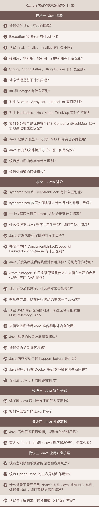

[分享海报](#sale-poster)
[内容目录](#content)

# sale-poster

# content

-    [结束语 | 技术没有终点](https://time.geekbang.org/column/article/12963)
-    [第39讲 | 谈谈常用的分布式ID的设计方案？Snowflake是否受冬令时切换影响？](https://time.geekbang.org/column/article/12806)
-    [第38讲 | 对比Java标准NIO类库，你知道Netty是如何实现更高性能的吗？](https://time.geekbang.org/column/article/12629)
-    [第37讲 | 谈谈Spring Bean的生命周期和作用域？](https://time.geekbang.org/column/article/12472)
-    [第36讲 | 谈谈MySQL支持的事务隔离级别，以及悲观锁和乐观锁的原理和应用场景？](https://time.geekbang.org/column/article/12288)
-    [周末福利 | 一份Java工程师必读书单](https://time.geekbang.org/column/article/12188)
-    [第35讲 | JVM优化Java代码时都做了什么？](https://time.geekbang.org/column/article/12003)
-    [第34讲 | 有人说“Lambda能让Java程序慢30倍”，你怎么看？](https://time.geekbang.org/column/article/11824)
-    [第33讲 | 后台服务出现明显“变慢”，谈谈你的诊断思路？](https://time.geekbang.org/column/article/11651)
-    [第32讲 | 如何写出安全的Java代码？](https://time.geekbang.org/column/article/11355)
-    [第31讲 | 你了解Java应用开发中的注入攻击吗？](https://time.geekbang.org/column/article/11211)
-    [第30讲 | Java程序运行在Docker等容器环境有哪些新问题？](https://time.geekbang.org/column/article/10975)
-    [第29讲 | Java内存模型中的happen-before是什么？](https://time.geekbang.org/column/article/10772)
-    [第28讲 | 谈谈你的GC调优思路?](https://time.geekbang.org/column/article/10651)
-    [第27讲 | Java常见的垃圾收集器有哪些？](https://time.geekbang.org/column/article/10513)
-    [第26讲 | 如何监控和诊断JVM堆内和堆外内存使用？](https://time.geekbang.org/column/article/10325)
-    [第25讲 | 谈谈JVM内存区域的划分，哪些区域可能发生OutOfMemoryError?](https://time.geekbang.org/column/article/10192)
-    [第24讲 | 有哪些方法可以在运行时动态生成一个Java类？](https://time.geekbang.org/column/article/10076)
-    [第23讲 | 请介绍类加载过程，什么是双亲委派模型？](https://time.geekbang.org/column/article/9946)
-    [第22讲 | AtomicInteger底层实现原理是什么？如何在自己的产品代码中应用CAS操作？](https://time.geekbang.org/column/article/9788)
-    [第21讲 | Java并发类库提供的线程池有哪几种？ 分别有什么特点？](https://time.geekbang.org/column/article/9712)
-    [第20讲 | 并发包中的ConcurrentLinkedQueue和LinkedBlockingQueue有什么区别？](https://time.geekbang.org/column/article/9588)
-    [第19讲 | Java并发包提供了哪些并发工具类？](https://time.geekbang.org/column/article/9373)
-    [第18讲 | 什么情况下Java程序会产生死锁？如何定位、修复？](https://time.geekbang.org/column/article/9266)
-    [第17讲 | 一个线程两次调用start()方法会出现什么情况？](https://time.geekbang.org/column/article/9103)
-    [第16讲 | synchronized底层如何实现？什么是锁的升级、降级？](https://time.geekbang.org/column/article/9042)
-    [周末福利 | 谈谈我对Java学习和面试的看法](https://time.geekbang.org/column/article/9014)
-    [第15讲 | synchronized和ReentrantLock有什么区别呢？](https://time.geekbang.org/column/article/8799)
-    [第14讲 | 谈谈你知道的设计模式？](https://time.geekbang.org/column/article/8624)
-    [第13讲 | 谈谈接口和抽象类有什么区别？](https://time.geekbang.org/column/article/8471)
-    [第12讲 | Java有几种文件拷贝方式？哪一种最高效？](https://time.geekbang.org/column/article/8393)
-    [第11讲 | Java提供了哪些IO方式？ NIO如何实现多路复用？](https://time.geekbang.org/column/article/8369)
-    [第10讲 | 如何保证集合是线程安全的? ConcurrentHashMap如何实现高效地线程安全？](https://time.geekbang.org/column/article/8137)
-    [第9讲 | 对比Hashtable、HashMap、TreeMap有什么不同？](https://time.geekbang.org/column/article/8053)
-    [第8讲 | 对比Vector、ArrayList、LinkedList有何区别？](https://time.geekbang.org/column/article/7810)
-    [第7讲 | int和Integer有什么区别？](https://time.geekbang.org/column/article/7514)
-    [第6讲 | 动态代理是基于什么原理？](https://time.geekbang.org/column/article/7489)
-    [第5讲 | String、StringBuffer、StringBuilder有什么区别？](https://time.geekbang.org/column/article/7349)
-    [第4讲 | 强引用、软引用、弱引用、幻象引用有什么区别？](https://time.geekbang.org/column/article/6970)
-    [第3讲 | 谈谈final、finally、 finalize有什么不同？](https://time.geekbang.org/column/article/6906)
-    [第2讲 | Exception和Error有什么区别？](https://time.geekbang.org/column/article/6849)
-    [第1讲 | 谈谈你对Java平台的理解？](https://time.geekbang.org/column/article/6845)
-    [开篇词 | 以面试题为切入点，有效提升你的Java内功](https://time.geekbang.org/column/article/6478)